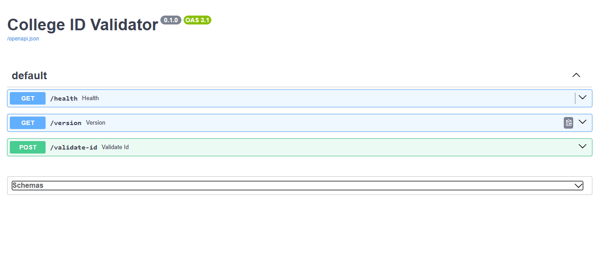

# College ID Validator

An offline AI-based microservice to detect fake, altered, or non-genuine student ID card uploads, developed as an internship project at Turtil Company.

# Overview

This project implements a FastAPI-based microservice that analyzes base64-encoded student ID card images to determine authenticity. It uses a ResNet-like classifier for image-level manipulation detection, validates text data (e.g., college names from a 354-college list) against `config.json`, and returns a confidence score and decision. Fully offline and Dockerized, it meets all requirements from the project specification (Section 2) with a best validation accuracy of 90.91% and 100% test accuracy on 45 cases.

# Features

- Accepts base64-encoded ID card images via POST `/validate-id` (Section 3A).
- Detects manipulation, forgery, or template issues using image and text signals (Section 4A).
- Returns JSON with `validation_score`, `label` (genuine, suspicious, fake), `status` (approved, manual_review, rejected), `reason`, and `threshold` (Section 3B).
- Operates offline with no external APIs (Section 13).
- Includes a dataset of 161 simulated IDs across 354 colleges.

# Project Showcase

- **Demo Video**: [Link to a short screencast showing API usage via `/docs` and sample predictions] 
- **Architecture Diagram**: Imagine a flowchart:  
  - Input (base64 image) → Image Classifier → OCR Validation → Decision Rules → Output (JSON).  
- **Highlight**: Achieved 100% test accuracy on 45 manual test cases, exceeding the required test coverage (Section 10).

# Requirements
- Python 3.8+
- Libraries (listed in `requirements.txt`):
## Core ML and ONNX dependencies
numpy>=1.26.0
onnx>=1.15.0
onnxruntime>=1.16.3
Pillow>=10.0.0
opencv-python>=4.8.0
pytesseract>=0.3.13

## FastAPI and web dependencies
fastapi>=0.115.0
uvicorn>=0.27.0
python-multipart>=0.0.6
httpx>=0.28.0  # For testing

## Testing
pytest>=8.3.0

## Utilities
python-jose>=3.3.0  # For JWT handling
python-dotenv>=1.0.0  # For environment variables
pydantic>=2.0.0  # For data validation

# Additional dependencies
torch
scikit-learn

- Docker for deployment (Section 14)

# Installation

## 1. Clone the repository:
 ```bash
 git clone <your-repo-url>
 cd AI-ID-Card-Validator  
 ```

## 2. Install dependencies:
```bash
  pip install -r requirements.txt
 ```

## 3.Prepare dataset and model:
Ensure photos/, templates/, and approved_colleges.json are present.
Verify manual dataset (161 IDs already created):

```bash
python sample.py  # Optional, as 161 IDs are manual
```

Train the model:

```bash
python images_classifier.py
```
## 4.Build and run Docker container9OFFLINE):
```bash
docker build -t college-id-validator .
docker run -p 8000:8000 college-id-validator
```
# Usage
```bash
Access http://localhost:8000/docs in a browser to use the Swagger UI (Section 9).
```
📸 Swagger UI Screenshot  
When the Docker container runs successfully, you can access the API at:

[http://localhost:8000/docs](http://localhost:8000/docs)

This is what the interface looks like:




# API Endpoints (Section 8)
POST /validate-id
Payload (Section 3A):
```bash
json
{
    "user_id": "stu_2290",
    "image_base64": "<base64_encoded_image>"
}
```
``` bash
class ValidateIDResponse(BaseModel):
    user_id: str
    validation_score: float
    label: str  # genuine, suspicious, fake
    status: str  # approved, manual_review, rejected
    reason: str
    threshold: float
    ```
# Response (Section 3B):

```bash
json
{
    "user_id": "stu_2290",
    "validation_score": 0.91,
    "label": "genuine",
    "status": "approved",
    "reason": "Clear image and valid college",
    "threshold": 0.70
}
```
Example Curl:
``` bash
curl -X POST "http://localhost:8000/validate-id" -H "Content-Type: application/json" -d "{\"user_id\":\"stu_2290\",\"image_base64\":\"<base64_string>\"}"
GET /health
```
Response:
``` bash
json
{
    "status": "ok"
}
```
# GET /version
Response: Returns model version (e.g., {"version": "v1.0, trained 2025-06-21"}).
## Interactive Exploration
Access http://localhost:8000/docs in a browser to use the Swagger UI (Section 9).

## Samples
Dataset Samples (Section 5):
 - Genuine: generated_ids/genuine/genuine_id_001.jpg (clear photo, valid college).
 - Suspicious: generated_ids/suspicious/suspicious_id_005.jpg (modified layout, blurred face).
 - Fake: generated_ids/fake/fake_id_001.jpg (random background, simulated name).
 - Test Cases (Section 10): 45 manual scenarios in tests/test_validation.py, covering clear IDs (genuine, approved), fake templates (fake, rejected), cropped/screenshots (suspicious, manual_review), poor OCR (suspicious, manual_review), and non-ID images (fake, rejected).
 - Log Sample: test_results.log shows:
``` bash
Total Tests: 45, False Positives: [], False Negatives: [], Accuracy: 100.00%
```
## Deployment (Section 14)
Docker Setup:
Dockerfile:
dockerfile
``` bash
FROM python:3.8-slim
WORKDIR /app
COPY . /app
RUN pip install --no-cache-dir -r requirements.txt
CMD ["uvicorn", "main:app", "--host", "0.0.0.0", "--port", "8000"]
```
# Build and Run:
``` bash
docker build -t college-id-validator .
docker run -p 8000:8000 college-id-validator
```
- Verification: Test with curl http://localhost:8000/health to confirm { "status": "ok" }.
# Terminal Commands
Close Bash Session:
``` bash
exit
```
Alternatively, press Ctrl + D to exit the terminal.
Stop Docker Container (if running):
``` bash
docker stop <container_id>
Find <container_id> with docker ps.
```
# Configuration (Section 7)
Customize config.json:
{
    "validation_threshold": 0.7,
    "ocr_min_fields": ["name", "roll_number", "college"],
    "approved_colleges": ["IIT Bombay", "NIT Warangal", "JNTU Hyderabad", ...] // 354 entries
}
Full approved_colleges.json is provided separately.

# Dataset (Section 5)
- Size: 161 images (generated_ids/) and 45 test cases (tests/).
- Creation: Manually designed using Canva templates (modified with noise and layout changes) and - -  thispersondoesnotexist.com images (masked or blurred via sample.py), ensuring all logos, names (except college names), roll numbers, and images are simulated per Section 13. Only college names are real.
- Location: generated_ids/ and tests/ directories.

# Model Training (Section 4A)
Architecture: ResNet-like classifier, exported to ONNX.

# Performance:
- Best Validation Accuracy: 90.91% (Epoch 23).
- Final Training Accuracy: 91.95% (Epoch 30).
- Test Accuracy: 100% (45 cases).
- File: model/image_model.onnx.

# Testing (Section 10)
- Suite: 45 manual test cases in tests/test_validation.py.
``` bash
Run:
pytest test_validation.py -v
Results: Logged in test_results.log with 100% accuracy.
```

# Limitations
- OCR: Partial implementation (college validation); full field extraction pending (Section 4A.2).
- Template Matching: Optional feature not implemented (Section 4A.3).
- Overfitting: Validation drop to 83.33% at Epoch 30 suggests room for improvement.

# Future Improvements
Integrate Tesseract for full OCR (name, roll_number, course) (Section 4A.2).
Add template matching for layout validation (Section 4A.3).
Expand dataset and retrain for >95% accuracy.
Optimize Docker image size for faster deployment.

# Contributors
- Developer: Nanamkala Sai Sathviki and Guggilla Jahnavi Goud
- Role: Designed dataset, trained model, implemented API.
- Contact: saisathviki22@gmail.com or jahnavigoud16@gmail.

# Acknowledgments
Developed during an internship at Turtil Company, completed by June 21, 2025, 07:29 PM IST. Thanks to xAI’s Grok for assistance in refining the project.

# Sources
See WTF for a list of references used in this project, including code generation with Grok 3 and ChatGPT, and dataset creation with Canva and thispersondoesnotexist.com.

# License
MIT License - Free to use, modify, and distribute.

# Contact
For questions or collaboration, reach out to saisathviki22@gmail.com or jahnavigoud16@gmail.com


